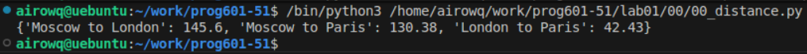

# **Отчёт**
## *Задание*
Создать словарь словарей между городами
## *Объяснение кода*
1. Объявляем словарь и сразу достаем ключи из данного словаря, помещая в список, для удобного дальнейшего использования значений
```python
distances = {}
cites = list(sites.keys())
```
2. Перебираем по два города с помощью циклов для этого во втором используем начальное значение i+1, чтобы города не повторялись и достаем координаты городов 
```python
for i in range (len(cites)):
    for j in range (i+1, len(cites)):
        x1, y1 = (sites[cites[i]])
        x2, y2 = (sites[cites[j]])
```
3. Высчитываем расстояния и помещаем их в словарь, для красивого вывода использовал f cтроку, (round - округляем до двух знаков после запятой) и принтим
```python
dist =  ((x1 - x2)**2 +  (y1 - y2)**2)**0.5
distances[f'{cites[i]} to {cites[j]}'] = round(dist, 2)
print(distances)
```
## *Результат*

## *Список использованных источников*
### [Учебник яндекса](https://education.yandex.ru/handbook/python/article/mnozhestva-slovari)