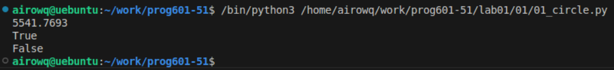

# **Отчёт**
## *Задания*
1. Вывести на консоль значение прощади этого круга с точностю до 4-х знаков после запятой
```python
print(round((pi*radius**2), 4))
```
2. Если точка point_1 лежит внутри круга, то выведите на консоль True, Или False, если точка лежит вне круга.
```python
def f(a, b):
    return (a**2+b**2)**0.5 < radius
```
Ввожу функцию, которая считает расстояние от начала координат до точки и если это расстояние меньше радиуса(точка лежит внутри круга), то она выводит True, иначе False
```python
print(f(point_1[0], point_1[1]))

```
3. Если точка point_2 лежит внутри круга, то выведите на консоль True, или False, если точка лежит вне круга.
Пользуемся функцией:
```python
print(f(point_2[0], point_2[1]))
```
## *Результат:*

