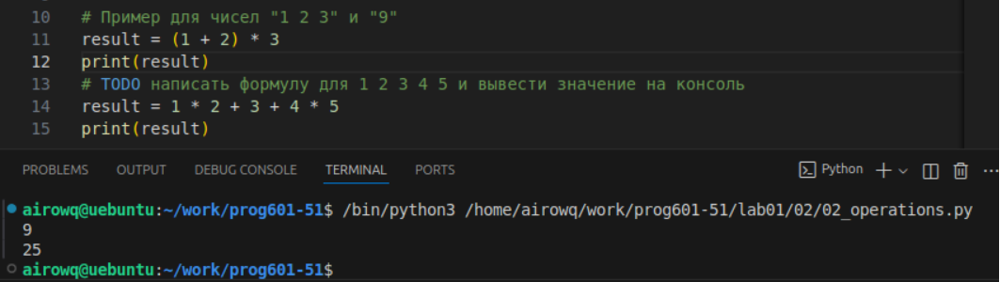

# **Отчёт**
## *Задание*
Расставьте знаки операций "плюс", "минус", "умножение" и скобки между числами "1 2 3 4 5" так, что бы получилось число "25".
```python
result = 1 * 2 + 3 + 4 * 5
print(result)
```
## *Результат:*

