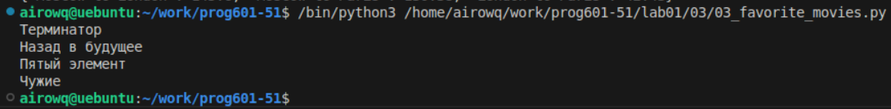

# **Отчёт**
## *Задание*
Выведите на консоль с помощью индексации строки, последовательно:
 - первый фильм
 - последний
 - второй
 - второй с конца
```python
my_favorite_movies = 'Терминатор, Пятый элемент, Аватар, Чужие, Назад в будущее'
print(my_favorite_movies[:10], my_favorite_movies[-15:], my_favorite_movies[12:25], my_favorite_movies[35:-17], sep='\n')
```
команда ```sep='\n'``` позволяет все написать в одном print, она разделяет элементы вывода командой \n (перенос строки) 
## *Результат:*
