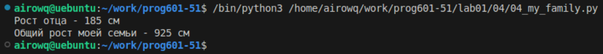

# **Отчёт**
## *Задание*
1. Выведите на консоль рост отца в формате
Рост отца - ХХ см
```python
my_family = ['Я', 'Мама', 'Папа', 'Брат', 'Сестра']
my_family_height = [
    ['Мама', 175],
    ['Папа', 185],
    ['Брат', 195],
    ['Сестра', 180],
    ['Я', 190]
]
print("Рост отца -", my_family_height[1][1], 'см')
```
2. Выведите на консоль общий рост вашей семьи как сумму ростов всех членов
Общий рост моей семьи - ХХ см
```python
summ = 0
for i in range(len(my_family)):
    summ += my_family_height[i][1]
print("Общий рост моей семьи -", summ, 'см')
```
создал переменную которая будет считать общий рост семьи, с помощью цикла перебрал рост каждого члена и прибавил в сумму
## *Результат:*
