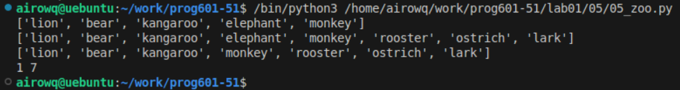

# **Отчёт**
## *Задание*
# есть список животных в зоопарке
```python
zoo = ['lion', 'kangaroo', 'elephant', 'monkey', ]
```
1. посадите медведя (bear) между львом и кенгуру и выведите список на консоль
```python
zoo.insert(1, 'bear')
print(zoo)
```
команда ``insert`` вставляет в список ваше значение по индексу

2. добавьте птиц из списка ```birds = ['rooster', 'ostrich', 'lark', ]``` в последние клетки зоопарка и выведите список на консоль
```python
zoo.extend(birds)
print(zoo)
```
команда ``extend`` добавляет в конец списка передаваемое значение(список птиц)

3. уберите слона и выведите список на консоль
```python
zoo.remove('elephant')
print(zoo)
```
4. выведите на консоль в какой клетке сидит лев (lion) и жаворонок (lark). Номера при выводе должны быть понятны простому человеку, не программисту.
```python
print(zoo.index('lion')+1, zoo.index('lark')+1)
```
увеличиваем число на 1, потому что индексы начинаются с 0, а клетки отсчитываются от первой
## *Результат:*
