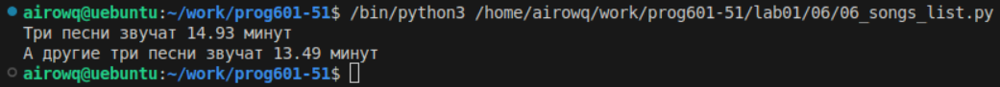

# **Отчёт**
## *Задание*
1. Есть список песен группы Depeche Mode со временем звучания с точностью до долей минут. Распечатайте общее время звучания трех песен: 'Halo', 'Enjoy the Silence' и 'Clean' в формате: Три песни звучат ХХХ.XX минут
```python
lst, summ = ['Halo', 'Enjoy the Silence', 'Clean'], 0
for i in range(len(violator_songs_list)):
    if violator_songs_list[i][0] in lst:
        summ += violator_songs_list[i][1]
print('Три песни звучат', round(summ,2), 'минут')
```
создаю список песен длительность, которых нужно посчитать, и сумму. С помощью цикла перебираю все песни, ``if`` проверяет есть ли песня в списке нужных песен, если да, то складываем длительность в сумму, иначе берем следующую песню. Выводим результат в заданном формате с точностью 2 знака после запятой.

2. Есть словарь песен группы Depeche Mode. распечатайте общее время звучания трех песен: 'Sweetest Perfection', 'Policy of Truth' и 'Blue Dress' в формате: А другие три песни звучат ХХХ минут
```python
summ, lst = 0, ['Sweetest Perfection', 'Policy of Truth', 'Blue Dress']
for a in lst:
    summ += violator_songs_dict[a]
print('А другие три песни звучат', round(summ, 2), "минут")
```
также создаю сумму и список песен, так как это словарь, работать с ним проще: вытягиваем из него ключ(длительность) по названию песни и складываем в сумму, после всего принтим.
## *Результат:*

## *Список использованных источников*
- [документация про функцию round](https://docs.python.org/3/search.html?q=round)