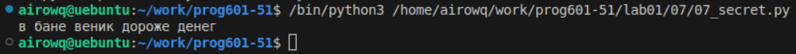

# **Отчёт**
## *Задание*
Есть зашифрованное сообщение. Нужно его расшифровать и вывести на консоль в удобочитаемом виде.
```python
print(secret_message[0][3], \
    secret_message[1][9:13], \
    secret_message[2][5:14:2], \
    secret_message[3][-20:-26:-1], \
    secret_message[4][16:21][::-1])
```
## *Результат:*

## *Список использованных источников*
[обратные срезы](https://clck.ru/MfEMS)