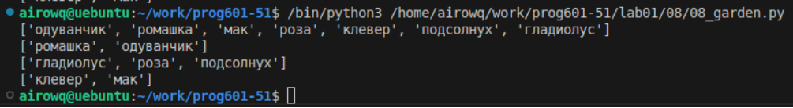

# **Отчёт**
## *Задание*
В саду сорвали цветы, на лугу сорвали цветы. Создайте множество цветов, произрастающих в саду и на лугу. 
### 1. Выведите на консоль все виды цветов
```python
garden_set = list(set([x for x in garden]))
meadow_set = list(set([x for x in meadow]))
print(list(set(meadow_set+garden_set)))
```
перебираем элементы ``[x for x in garden]`` с помощью конструкции ``list(set())`` убираем повторяющиеся элементы принтим все виды цветов убирая повторки
### 2. Выведите на консоль те, которые растут и там и там
```python
print([x for x in meadow_set if x in garden_set])
```
перебираем элементы одного списка, но добавляем только те, что есть и во втором списке и все это записываем в принт для краткости
### 3. Выведите на консоль те, которые растут в саду, но не растут на лугу
```python
print([x for x in garden_set if not(x in meadow_set)])
```
перебираем элементы(цветы) из первого списка(сада), с условием, что они не встречаются во втором списке(на лугу)
### 4. Выведите на консоль те, которые растут на лугу, но не растут в саду
```python
print([x for x in meadow_set if not(x in garden_set)])
```
тоже самое что и в третьем задании
## *Результат:*
