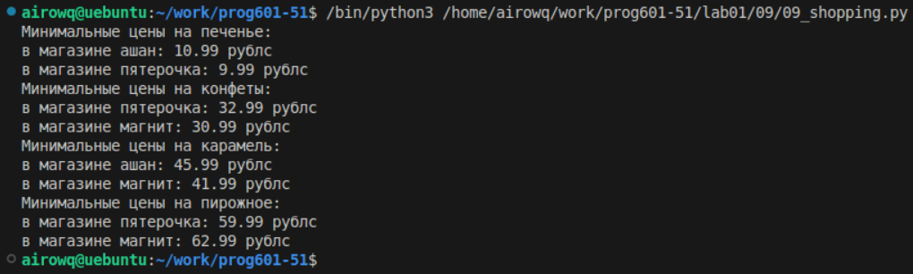

# **Отчёт**
## *Задание*
### Создайте словарь цен на продкты следующего вида (писать прямо в коде). Вывести по 2 магазина с минимальными ценами
Создаю список сладостей для дальнейшего удобного пользования словарем, в цикле будем перебирать сладости. Создаю массив прайс, в котором буду сохранять все цены на определенную сладость и словарь "s", чтобы проверять каждую сладость в конкретном магазине по конкретной цене
```python
mysweet = ("печенье", "конфеты", "карамель", "пирожное")
for a in mysweet:
    price = []
    s = {}
```
В этом цикле записываем все цены проходясь по каждому магазину, после цикла удаляем из массива самый большой прайс, оставляя ```2 минимальные цены```
```python
for i in range(3):
    b = (sweets[a][i])
    price.append(b['price'])
price.remove(max(price))
```
Принт просто для красивого вывода. Далее с помощью цикла берем конкретный магазин с конкретной ценой и ```if``` цена соотвествует двум минимальным прайсам выводим магазин и цену
```python
print(f'Минимальные цены на {a}:')
for i in range(3):
    s = (sweets[a][i])
    if s['price'] in price:
        print(f'в магазине {s['shop']}: {s['price']} рублс')
```
## *Результат:*

## *Список использованных источников*
### [Учебник яндекса](https://education.yandex.ru/handbook/python/article/mnozhestva-slovari)