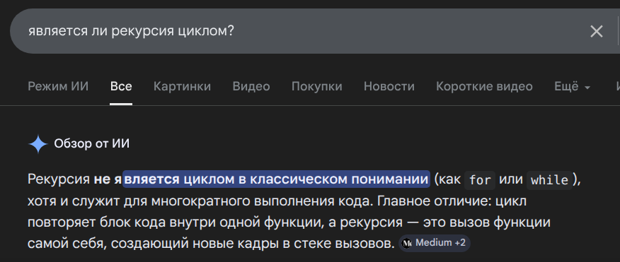
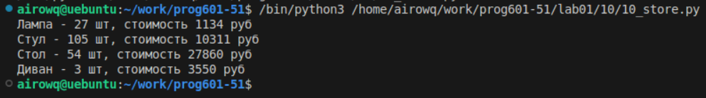

# **Отчёт**
## *Задание*
### Есть словарь кодов товаров. Есть словарь списков количества товаров на складе. Рассчитать на какую сумму лежит каждого товара на складе
Так как пользоваться циклами нельзя, создаю функции, которые не являются циклами [*тык*](https://clck.ru/3SwuBW)


Первая считает количество товара на складе. С помощью try мы заходи в эту функцию еще раз(следующий склад), если он существует то считаем количество и с него, а если нет, то expect выводим уже имеющееся количество. Тоже самое и со второй функцией, но считаем общую стоимость
```python
def kol(a, b):
    try: 
        return store[goods[a]][b]['quantity'] + kol(a, b+1)
    except:
        return store[goods[a]][b]['quantity']
def sel(a, b):
    try:
        return store[goods[a]][b]['quantity'] * store[goods[a]][b]['price'] + sel(a, b+1)
    except:
        return store[goods[a]][b]['quantity'] * store[goods[a]][b]['price']
```
Далее просто выводим все значения из функций:
```python
print(
    "Стул -", kol('Стул',0), 'шт, стоимость', sel('Стул',0), "руб\n"\
    "Стол -", kol('Стол',0), 'шт, стоимость', sel('Стол',0), "руб\n"\
    "Диван -", kol('Диван',0), 'шт, стоимость', sel('Диван',0), "руб")
```
## *Результат:*
