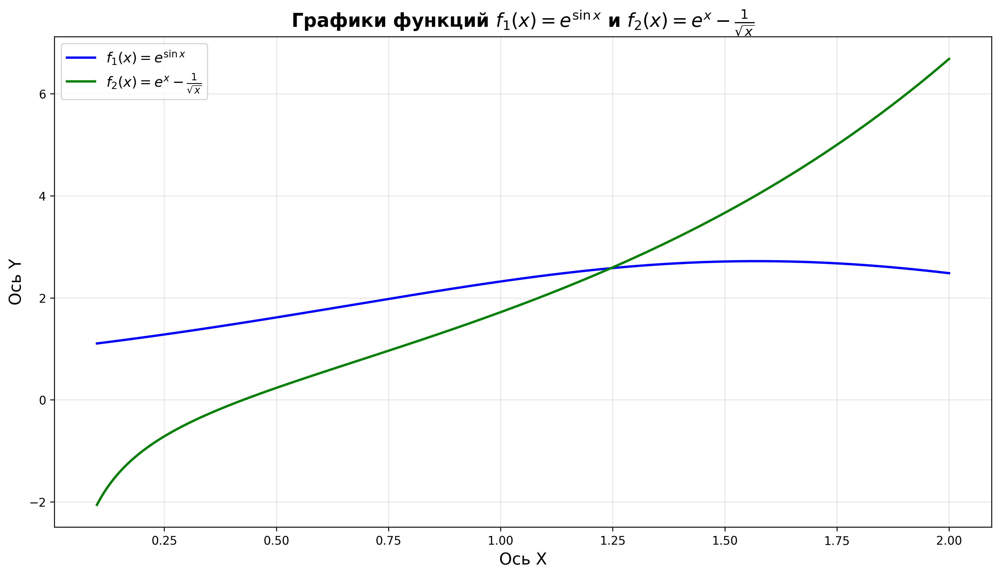

# **Отчёт**
## *Задание*
### 1. Создайте в каталоге для данной ЛР в своём репозитории виртуальное окружение и установите в него matplotlib и numpy. Создайте файл requirements.txt.
### 2. Откройте книгу [1] и выполните уроки 1-3. Первый урок можно начинать со стр. 8.
### 3. Выберите одну из неразрывных функции своего варианта, постройте график этой функции и касательную к ней. Добавьте на график заголовок, подписи осей, легенду, сетку, а также аннотацию к точке касания.
### 4. Добавьте в корень своего репозитория файл .gitignore отсюда, перед тем как делать очередной коммит.
### 5. Оформите отчёт в README.md. Отчёт должен содержать: графики, построенные во время выполнения уроков из книги; объяснения процесса решения и график по заданию 4
### 6. Склонируйте этот репозиторий НЕ в ваш репозиторий, а рядом. Изучите использование этого инструмента и создайте pdf-версию своего отчёта из README.md. Добавьте её в репозиторий.
## *Ход работы*
1) установил matplotlib и numpy в свое виртуально окружение. Создал файл requirements.txt
2) выполнил уроки из книги
3) код
создаём функции:
```python
def f1(x):
    return np.exp(np.sin(x))
def f2(x):
    return np.exp(x) - 1 / np.sqrt(x)
```
Подготавливаю график: создаю 500 точек между 0.1 и 2, (0.1 потому что в f2 есть деление, иначе было бы деление на 0). И вычисляем значения y1 y2
```python
x = np.linspace(0.1, 2, 500)
y1 = f1(x)
y2 = f2(x)
```
cоздаём окно 12х7, легенду и задаем толщину
```python
plt.figure(figsize=(12, 7))
plt.plot(x, y1, 'b-', linewidth=2, label='$f_1(x) = e^{\\sin x}$')
plt.plot(x, y2, 'g-', linewidth=2, label='$f_2(x) = e^x - \\frac{1}{\\sqrt{x}}$')
```
задаем заголовок и подписи осей с размером шрифта, автоматически размещает легенду, выставляем прозрачность 30%, настраиваем отступы и отображаем график
```python
plt.title('Графики функций $f_1(x) = e^{\\sin x}$ и $f_2(x) = e^x - \\frac{1}{\\sqrt{x}}$', fontsize=16, fontweight='bold')
plt.xlabel('Ось X', fontsize=14)
plt.ylabel('Ось Y', fontsize=14)
plt.legend(loc='best',fontsize=12)
plt.grid(True, alpha=0.3)
plt.tight_layout()
plt.show()
```
4) Добавил .gitignore

Результат:


### Список использованных источников
- [NumPy](https://numpy.org/doc/stable/reference/routines.math.html)
- [Matplotlib](https://matplotlib.org/stable/tutorials/pyplot.html)