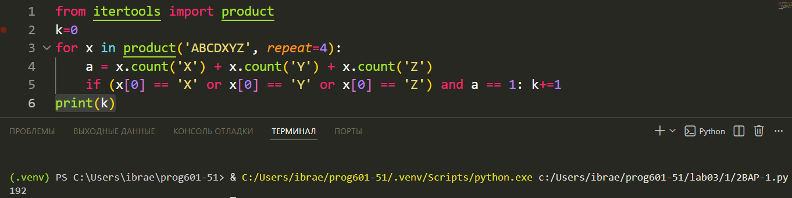

# **Отчёт**
## *Задание*
Ольга составляет таблицу кодовых слов для передачи сообщений, каждому сообщению соответствует своё кодовое слово. В качестве кодовых слов Ольга использует 4-буквенные слова, в которых есть только буквы A, B, C, D, X, Y, Z. При этом первая буква кодового слова  — это буква X, Y или Z, а далее в кодовом слове буквы X, Y и Z не встречаются. Сколько различных кодовых слов может использовать Ольга?
---
покдлючаем модуль itertools функцию product, так как понадобится только она и создаем счётчик кодовых слов
```python
from itertools import product
k=0 
```
перебираем "х", который представляет из себя 4-значные коды из букв 'ABCDXYZ'
```python
for x in product('ABCDXYZ', repeat=4): 
```
складываем кол-во x, y и z в коде (х) и проверяем по условию чтобы одна из этих букв стояла на первом месте, а также чтобы эти буквы не были в коде далее `a == 1`, если условия выполняются то засчитываем код
```python
a = x.count('X') + x.count('Y') + x.count('Z')
if (x[0] == 'X' or x[0] == 'Y' or x[0] == 'Z') and a == 1: k+=1 
```
принтим результат
```python
print(k)
```
Реузультат:


## Список использованных источников
[itertools](https://docs.python.org/3/library/itertools.html)  