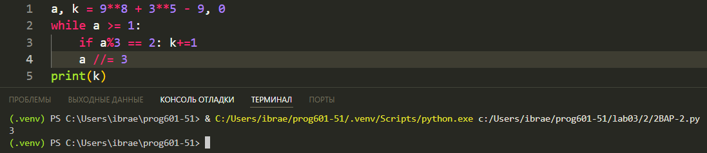

# **Отчёт**
## *Задание*
Значение арифметического выражения 9^8 + 3^5 - 9 записали в системе счисления с основанием 3.
Сколько цифр 2 содержится в этой записи?
---
Для начала записываем само выражение и создаем будущий счетчик двоек
```python
a, k = 9**8 + 3**5 - 9, 0
```
Далее нам нужно подсчитать кол-во двоек в троичной записи числа `a`. Я бы мог создать отдельную переменную для троичной записи, перевести в троичную СС и подсчитать с помощью `.count`, но можно сразу во время перевода числа в троичную запись (троичную запись не сохраняем) проверять является ли эта цифра `двойкой` и считать ее
```python
while a >= 1:
    if a%3 == 2: k+=1
    a //= 3
```
принтим
```python
print(k)
```
Реузультат:



## Список использованных источников
[count - это мы знаем](https://docs.python.org/3/library/stdtypes.html#str.count)  