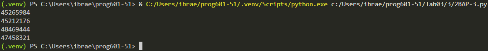

# **Отчёт**
## *Задание*
# Найдите все натуральные числа, принадлежащие отрезку [45000000; 50000000], у которых ровно пять
# различных нечётных делителей (количество чётных делителей может быть любым). 
# Выведите найденные числа в порядке возрастания.
---
У числа будет ровно 5 различных делителей, если оно имеет вид 2^k * p^4 поэтому, чтобы найти такие числа будет перебирать k - степени двойки и p - простые числа. P мы будем перебирать до 84, так как 85^4 > 50_000_000, а степень двойки только до 26, так как 2^26 > 50000000
1. Начнём с поиска p
```python
s = []
def f(x):
    for i in range(2, int(x**0.5)+1):
        if x%i ==0: return False
    return True
```
создаём пустой список и функцию которая считает количество делителей числа, но по своей сути она будет возвращать False каждый раз, когда она найдет делитель, а если не нашла то возвращает True
```python
for p in range(1, 85, 2):
    if f(p): s.append(p)
```
перебираем всевозможные p и проверяем его в функции если p - простое число, то добавляем его в s
2. Всевозможные комбинации 2^k * p^4
```python
for p in s:
    for k in range(0, 26):
        a = (2**k) * (p**4)
        if a>45_000_000 and a<50_000_000: print(a)
```
я отказался от for'a от 45_000_000 до 50_000_000 так как это будет сильно замедлять работу кода и решил просто перебрать всевозможные 2^k * p^4 а потом проверить их принадлежность к указанному промежутку, в итоге получаем очень быстрый код

Реузультат:

