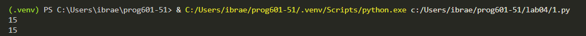
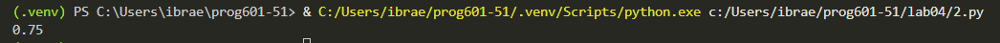

# Отчёт по лабораторной работе №4
## Рекурсивные и итеративные алгоритмы обработки данных

---

## Условия задач

### Задача 1. Подсчёт суммы элементов во вложенных списках

Написать функцию для вычисления суммы всех числовых элементов в списке, который может содержать другие списки на любую глубину вложенности.

**Пример работы:**
| Входные данные | Выходные данные |
|----------------|-----------------|
| `[1, [2, [3, 4, [5]]]]` | `15` |
| `[10, [20, 30], [[40]], 5]` | `105` |

### Задача 2. Вычисление рекуррентной последовательности

Дана последовательность:

- a₁ = 1, b₁ = 1
- aₖ = ½ · (√bₖ₋₁ + ½ · √aₖ₋₁)

Для заданного k (натуральное число) необходимо вычислить значение aₖ.

**Пример расчёта:**
- k = 1 → a₁ = 1
- k = 2 → a₂ = 0.5 · (√1 + 0.5 · √1) = 0.5 · (1 + 0.5) = 0.5 · 1.5 = 0.75

---

## Описание проделанной работы

### Задача 1. Сумма элементов вложенных списков

Были разработаны два подхода к решению задачи: рекурсивный и итеративный (с использованием стека).

#### Рекурсивная версия

Принцип работы:
1. Функция принимает список и проходит по каждому его элементу
2. Если элемент является целым числом — добавляет его к общей сумме
3. Если элемент является списком — рекурсивно вызывает функцию для обработки этого списка

```python
def recursive_sum(nested_list):
    total = 0
    for element in nested_list:
        if type(element) == int:
            total += element
        elif type(element) == list:
            total += recursive_sum(element)
    return total
    def iterative_sum(nested_list):
    total = 0
    stack = [nested_list]
    while stack:
        current = stack.pop()
        for element in current:
            if isinstance(element, list):
                stack.append(element)
            else:
                total += element
    return total 
```
## Скриншоты результатов

**Задача 1.**



**Задача 2.**


