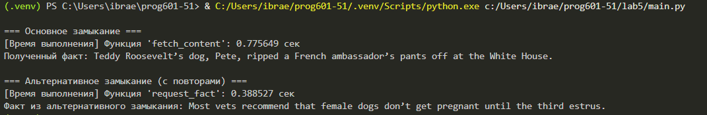

# Отчёт по лабораторной работе №5
## Тема: Реализация замыканий и декораторов в Python для HTTP-запросов

---

## 1. Цель работы

Изучение и практическое применение механизмов **замыканий (closures)** и **декораторов (decorators)** в языке Python на примере получения данных из веб-API.

### 1.1. Задачи работы

| № | Задача | Способ реализации |
|---|--------|-------------------|
| 1 | Создать замыкание для отправки GET-запросов | Внешняя функция, возвращающая внутреннюю |
| 2 | Реализовать декоратор для измерения времени | Обёртка функции с замером до/после выполнения |
| 3 | Обработать ошибки запроса и парсинга | Блоки try-except для разных типов исключений |
| 4 | Протестировать работу с реальным API | Выполнение запросов к dogapi.dog |

---

## 2. Теоретические сведения

### 2.1. Что такое замыкание?

**Определение:** Замыкание — это функция, которая сохраняет ссылки на переменные из внешней области видимости даже после завершения выполнения внешней функции.

**Условия создания замыкания:**
1. Существует внешняя функция
2. Внутри неё определяется внутренняя функция
3. Внутренняя функция использует переменные внешней функции
4. Внешняя функция возвращает внутреннюю функцию

**Пример схемы замыкания:**

### 2.2. Что такое декоратор?

**Определение:** Декоратор — это функция высшего порядка, которая принимает другую функцию и возвращает её модифицированную версию.

**Применение декораторов:**
- Логирование выполнения
- Измерение производительности
- Проверка прав доступа
- Кэширование результатов

### 2.3. Используемое API

| Параметр | Значение |
|----------|----------|
| Базовый URL | `https://dogapi.dog` |
| Эндпоинт | `/api/v2/facts` |
| Метод | GET |
| Формат ответа | JSON |
| Таймаут | 2-3 секунды |

**Структура успешного ответа:**
```json
{
  "data": [
    {
      "id": "uuid",
      "type": "fact",
      "attributes": {
        "body": "Текст факта о собаке"
      }
    }
  ]
}
```

## 3. Вывод программы:
