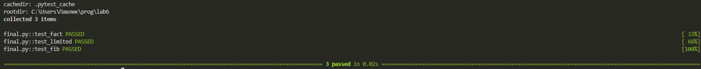

# Отчёт по лабораторной работе №6
## Тема: Разработка генераторов для обработки больших файлов

---
## Условие задачи

**Сложность:** Rare

**Задание:** Реализовать **генератор** для построчного чтения файла. Если длина строки превышает заданный предел — возвращает подстроку допустимого размера.

**Требования:**
- Генератор должен принимать путь к файлу и максимальную длину строки
- Построчно читать файл и возвращать строки (или их части) размером не более заданного предела
- Если строка длиннее предела — разбить её на несколько последовательных частей
- Использовать оператор `yield` для возврата значений
- Применить **декоратор** для логирования работы генератора
- Обработать возможные ошибки (файл не найден, нет прав доступа, проблемы с кодировкой)

---

## Описание проделанной работы

### 1. Что такое генератор

**Генератор** — это функция, которая использует оператор `yield` вместо `return`. При каждом вызове `next()` генератор продолжает выполнение с места последнего `yield`, автоматически сохраняя своё состояние.

**Преимущества генераторов:**
- Автоматическое сохранение состояния между вызовами
- Экономия памяти (значения генерируются на лету)
- Более чистый и читаемый код

### 2. Реализация декоратора `measure_time`

Декоратор использует `time.perf_counter()` для высокоточного измерения времени выполнения функции. Он оборачивает целевую функцию, замеряет время до и после вызова и выводит результат в консоль. Благодаря `functools.wraps` сохраняется метаинформация о декорируемой функции.

```python
def measure_time(original_func):
    @wraps(original_func)
    def wrapped(*args, **kwargs):
        start = time.perf_counter()
        output = original_func(*args, **kwargs)
        end = time.perf_counter()
        print(f"[TIMER] Duration: {end - start:.4f} sec.")
        return output
    return wrapped
```
## 3. Реализация замыкания make_chunk_reader
Функция make_chunk_reader реализует замыкание для построчного чтения файла с ограничением длины строки. Ниже представлен полный код с комментариями.
```python
def make_chunk_reader(filepath, max_chunk_size, encoding='utf-8'):
    """
    Возвращает функцию, которая при каждом вызове отдаёт следующий кусок текста.
    Длинные строки разбиваются на части.
    Args:
        filepath: путь к файлу
        max_chunk_size: максимальная длина строки (количество символов)
        encoding: кодировка файла (по умолчанию utf-8)
    Returns:
        функцию, которая при каждом вызове возвращает следующую часть текста
    """
    if max_chunk_size <= 0:
        raise ValueError("max_chunk_size must be positive")
    # Попытка открыть файл
    try:
        handle = open(filepath, 'r', encoding=encoding)
    except FileNotFoundError:
        print(f"Error: File '{filepath}' not found")
        return None
    except PermissionError:
        print(f"Error: Permission denied for '{filepath}'")
        return None
    except UnicodeDecodeError:
        # Пробуем другую кодировку
        try:
            handle = open(filepath, 'r', encoding='cp1251')
            print(f"[WARN] Fallback to cp1251 encoding")
        except Exception as e:
            print(f"Error: Cannot read file - {e}")
            return None
    # Переменные замыкания
    leftover = ""       # остаток от предыдущей длинной строки
    exhausted = False   # флаг окончания файла
    
    def next_chunk():
        nonlocal leftover, exhausted
        
        # Если файл уже закончился и нет остатка
        if exhausted and not leftover:
            return None
        
        # Если есть остаток от предыдущей длинной строки
        if leftover:
            if len(leftover) <= max_chunk_size:
                result = leftover
                leftover = ""
                return result
            else:
                result = leftover[:max_chunk_size]
                leftover = leftover[max_chunk_size:]
                return result
        
        # Читаем следующую строку из файла
        line = handle.readline()
        
        # Если файл закончился
        if not line:
            exhausted = True
            handle.close()
            return None
        
        # Удаляем символ перевода строки
        line = line.rstrip('\n\r')
        
        # Если строка целиком помещается в лимит
        if len(line) <= max_chunk_size:
            return line
        
        # Если строка длиннее лимита - разбиваем
        result = line[:max_chunk_size]
        leftover = line[max_chunk_size:]
        return result
    
    return next_chunk
```
## 4. Реализация тестов (уровень Medium)
Для проверки корректности работы генераторов были созданы три теста в файле tests_hidden.py:
1. Бесконечный генератор (endless_source):
    - Принимает список элементов
    - Бесконечно возвращает случайный элемент
    - Использует while True и yield
2. Генератор с ограничением (bounded_source):
    - Принимает список элементов и лимит (по умолчанию 5)
    - Возвращает ровно limit элементов, после чего завершается
3. Генератор чисел Фибоначчи (numeric_sequence):
    - Принимает лимит (по умолчанию 10)
    - Возвращает последовательность чисел Фибоначчи: 0, 1, 1, 2, 3, 5, 8...

```python
def endless_source(data_pool):
    while True:
        yield random.choice(data_pool)

def bounded_source(data_pool, upper_bound=5):
    counter = 0
    while counter < upper_bound:
        yield random.choice(data_pool)
        counter += 1

def numeric_sequence(limit=10):
    x, y = 0, 1
    step = 0
    while step < limit:
        yield x
        x, y = y, x + y
        step += 1
```
Тесты:
```python
def verify_endless():
    sample = ["alpha", "beta"]
    gen = endless_source(sample)
    assert isinstance(next(gen), str)

def verify_bounded():
    sample = ["gamma"]
    gen = bounded_source(sample, 3)
    assert len(list(gen)) == 3

def verify_sequence():
    expected = [0, 1, 1, 2, 3, 5, 8, 13, 21, 34]
    assert list(numeric_sequence(10)) == expected
```

## 3. Вывод программы
 