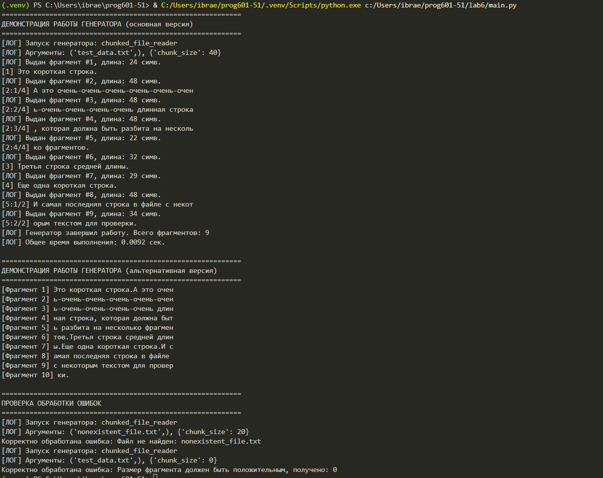

# Отчёт по лабораторной работе №6
## Тема: Разработка генераторов для обработки больших файлов

---

## 1. Цель работы

Изучить механизм работы **генераторов** в языке Python и применить их для эффективной обработки текстовых файлов с ограничением длины выводимых строк.

### 1.1. Задачи работы

| № | Задача | Реализация |
|---|--------|------------|
| 1 | Создать генератор для построчного чтения файла | Функция с оператором `yield` |
| 2 | Реализовать разбиение длинных строк на фрагменты | Алгоритм циклического деления строки |
| 3 | Применить декоратор для логирования | Обёртка генератора с подсчётом фрагментов |
| 4 | Обработать возможные исключения | Блоки try-except для различных типов ошибок |

---

## 2. Теоретическая часть

### 2.1. Генераторы в Python

**Генератор** — это особый тип итератора, который создаётся с помощью функции, содержащей ключевое слово `yield`. В отличие от обычной функции, которая завершается после `return`, генератор сохраняет своё состояние и может возобновить работу при следующем вызове.

**Сравнение с обычными функциями:**

| Характеристика | Обычная функция | Генератор |
|----------------|-----------------|-----------|
| Возврат значений | Одно значение | Последовательность значений |
| Сохранение состояния | Нет | Да (автоматически) |
| Оператор | `return` | `yield` |
| Использование памяти | Результат хранится целиком | Значения генерируются по запросу |

### 2.2. Декораторы генераторов

Декораторы могут применяться к генераторам так же, как и к обычным функциям. Однако важно учитывать, что декоратор должен возвращать генератор, а не выполнять его полностью.

### 2.3. Обработка ошибок при работе с файлами

| Тип ошибки | Причина | Способ обработки |
|------------|---------|------------------|
| `FileNotFoundError` | Файл не существует | Проверка через `os.path.exists()` |
| `PermissionError` | Нет прав на чтение | Перехват исключения |
| `UnicodeDecodeError` | Неправильная кодировка | Указание параметра `encoding` |
| `ValueError` | Некорректные параметры | Проверка входных данных |

---

## 3. Реализация программы

### 3.1. Декоратор логирования

```python
def logger_decorator(func):
    @wraps(func)
    def wrapper(*args, **kwargs):
        print(f"[ЛОГ] Запуск генератора: {func.__name__}")
        print(f"[ЛОГ] Аргументы: {args}, {kwargs}")
        
        start_time = time.time()
        gen = func(*args, **kwargs)
        fragment_count = 0
        
        try:
            while True:
                value = next(gen)
                fragment_count += 1
                print(f"[ЛОГ] Выдан фрагмент #{fragment_count}, длина: {len(value)} симв.")
                yield value
        except StopIteration:
            end_time = time.time()
            print(f"[ЛОГ] Генератор завершил работу. Всего фрагментов: {fragment_count}")
            print(f"[ЛОГ] Общее время выполнения: {end_time - start_time:.4f} сек.")
    
    return wrapper
```
## 3. Вывод программы
